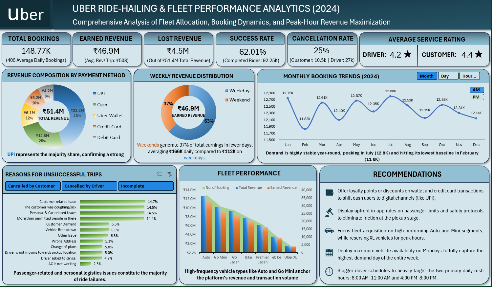
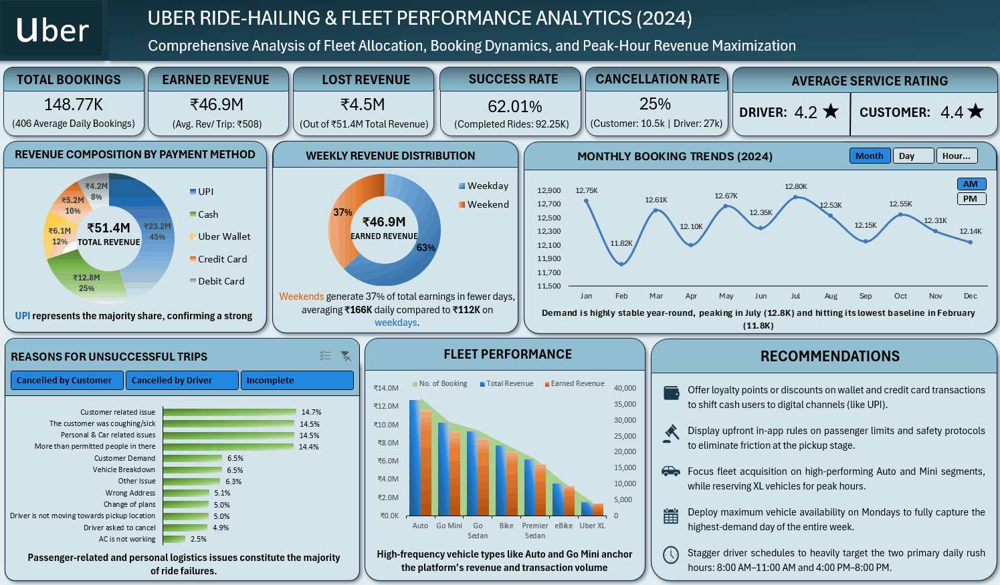
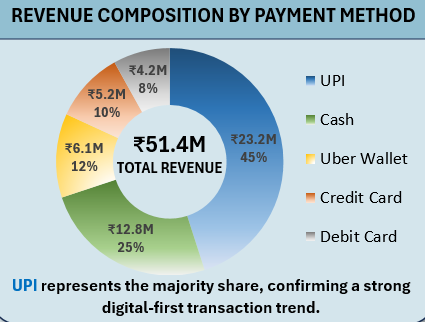
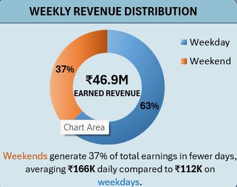
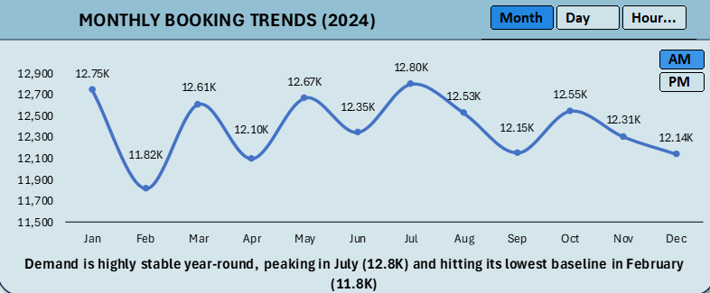
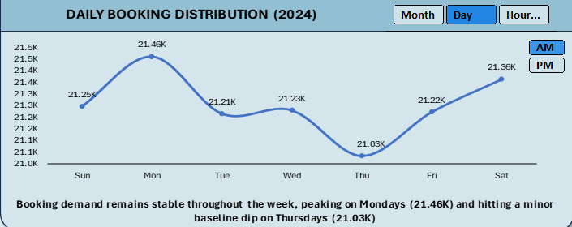
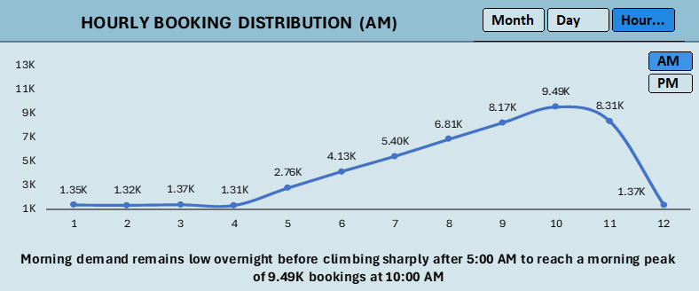
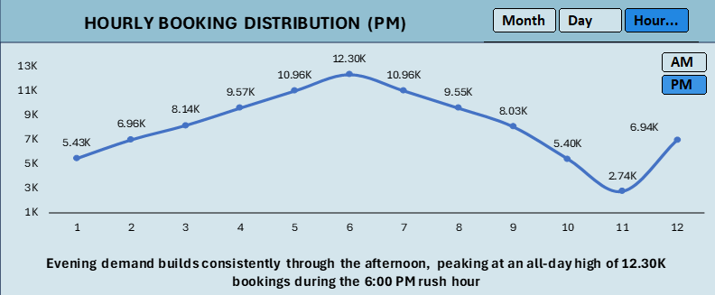
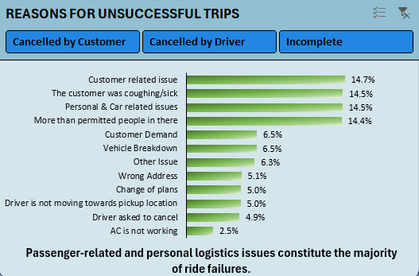
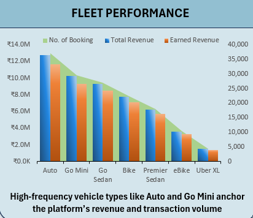

# Uber Ride-Hailing & Fleet Performance Analytics (2024) Dashboard

## Dashboard Preview

## Dynamic Interactivity

# Project Overview

Managing a massive ride-hailing network involves a constant battle against time and empty seats. To truly maximize profitability, operators cannot just rely on overall monthly booking numbers; they need to understand exactly when and where passenger demand spikes and why certain runs are dropping in revenue density.

I took an Uber Ride Analytics Synthetic Dataset from 2024 and built a streamlined performance dashboard to help fleet managers make fast, data-driven scheduling decisions. By breaking down booking volumes by the month, day and hour, analyzing vehicle segment performance (like Auto vs. Uber XL), and tracking the shift away from cash toward digital payments, the dashboard pinpoints exactly how to align driver supply with peak passenger rushes to eliminate missed revenue opportunities.

# Problem Statement

## The Challenge

A ride-hailing network functions like a giant puzzle where driver supply and passenger demand must match perfectly in real time. When they don't, the system breaks down: drivers cancel because trips are poorly aligned, customers face long wait times, and massive amounts of potential revenue slip through the cracks. The core issue isn't a lack of market demand; it is the operational friction that prevents requested bookings from becoming completed, profitable rides.

## Objectives & Motivation

I designed this project to pinpoint exactly where this friction occurs and discover how to bridge the gap between booking requests and actual revenue. By building a comprehensive dashboard equipped with a dedicated Strategic Recommendation Section, my core objectives were to:

*	**Key Performance Indicators:** Track high-level metrics, including total bookings, earned vs. lost revenue, success & cancellation rates, and average service ratings (driver & customer), to provide an instant, health-check baseline of network efficiency.

*	**Deconstruct Demand Chronology:** Map time-series data across three distinct layers, using dynamic line charts for monthly booking trends, daily booking distributions, and hourly booking waves (AM/PM)—to capture the exact pulse of passenger demand.
*	**Analyze Financial Flows:** Analyzed weekly revenue distribution and revenue composition by payment method to evaluate the impact of weekend-to-weekday shifts and trace cash-to-digital payment profiles.
*	**Investigate Fleet Friction:** Investigate the underlying patterns behind driver and customer cancellations to find out when and why bookings fail.
*	**Evaluate Fleet Yield:** Assess vehicle segment productivity to determine which tiers maximize volume versus revenue.

# Microsoft Excel Skills Used

*	Power Query (Data Extract, Transform, and Load (ETL))
*	EDA (Data Preparation & Cleaning, Feature Engineering)
*	Power Pivot
*	DAX (Data Analysis Expressions)
*	Explicit Measures & Custom KPI Calculations
*	Advanced Pivot Tables & Pivot Charts
*	Dynamic Time-Series Analytics
*	Slicer & Timeline Connections (Interactive Dashboard Control)

# The Dataset

This project utilizes a comprehensive dataset consisting of 148.77K transactional booking records (2024) capturing real-time Uber ride-sharing operations, financial metrics, and vehicle types. Because this is a synthetic dataset, it contained several critical structural anomalies that required rigorous transformation. 

[Access Raw Dataset](ncr_ride_bookings_RawDataset.csv)

## Data Dictionary

* **Date:** Date of the booking
* **Time:** Time of the booking
* **Booking ID:** Unique identifier for each ride booking
* **Booking Status:** Status of booking (Completed, Cancelled by Customer, Cancelled by Driver, etc.)
* **Customer ID:** Unique identifier for customers
* **Vehicle Type:** Type of vehicle (Go Mini, Go Sedan, Auto, eBike/Bike, UberXL, Premier Sedan)
* **Pickup Location:** Starting location of the ride
* **Drop Location:** Destination location of the ride
* **Avg VTAT:** Average time for driver to reach pickup location (in minutes)
* **Avg CTAT:** Average trip duration from pickup to destination (in minutes)
* **Cancelled Rides by Customer:** Customer-initiated cancellation flag
* **Reason for cancelling by Customer:** Reason for customer cancellation
* **Cancelled Rides by Driver:** Driver-initiated cancellation flag
* **Driver Cancellation Reason:** Reason for driver cancellation
* **Incomplete Rides:** Incomplete ride flag
* **Incomplete Rides Reason:** Reason for incomplete rides
* **Booking Value:** Total fare amount for the ride
* **Ride Distance:** Distance covered during the ride (in km)
* **Driver Ratings:** Rating given to driver (1-5 scale)
* **Customer Rating:** Rating given by customer (1-5 scale)
* **Payment Method:** Method used for payment (UPI, Cash, Credit Card, Uber Wallet, Debit Card)

# Dashboard Design

## Data Preparation 

Before building the visual interface, I performed a rigorous ETL process in Power Query to clean the raw, synthetic dataset and engineer new features for deep time-series analysis.

### ETL (Extract, Transform, Load) 

*	**Entity Integrity & Deduplication:** I resolved structural anomalies where identical Booking IDs were assigned to distinct Customer IDs and timestamps. To prevent skewed metrics, I implemented a deduplication step to retain only the unique, final, valid trip events.

*	**Data Cleaning & Text Normalization:** I cleaned key identifier fields by stripping out rogue characters from both Booking ID and Customer ID to ensure accurate string matching and relationship mapping in Power Pivot.
*	**Time-Series Value Extraction (Feature Engineering):** To capture granular demand waves, I extracted explicit time attributes from the baseline fields:
*	**From Date:** Derived day, day name, month name, month number, and week of the month to map weekly patterns and weekend surges.
*	**From Time:** Extracted hour and AM/PM shifts to build hourly distribution metrics.

### DAX Feature Engineering

I built robust, explicit DAX measures in Power Pivot to drive the dashboard's KPIs and dynamic charts. While I experimented with a broad suite of operational variables during modeling, I intentionally streamlined the final dashboard to focus on the core metrics recruiters and executive stakeholders care about most:

*	**Volume & Success Baselines:** Total Bookings, Completed Rides, and the overarching Success Rate.

*	**Financial Impact:** Earned Revenue versus Lost Revenue to immediately quantify the cost of network friction.
*	**Failure Analysis:** Cancellation Rate to isolate dropped demand.
*	**Service Quality:** Average Driver Rating and Average Customer Rating to monitor two-way marketplace health.

## Analysis

### 1.	Revenue Composition by Payment Method

  

Digital payments (UPI, Uber Wallet, Credit/Debit cards) account for 75% of total revenue, with UPI alone dominating as the primary revenue driver at ~45%. This reflects a high degree of customer preference for seamless, integrated digital payment ecosystems over traditional cash-based transactions.

### 2.	Weekly Revenue Distribution

  

This donut chart highlights a massive surge in revenue density over the weekend. Despite accounting for only 28% of the calendar year, weekends drive a disproportionate 37% of total earnings, averaging ₹166K per day compared to just ₹112K on weekdays. This stark contrast underscores that weekend passenger demand yields a significantly higher financial impact in a shorter timeframe.

### 3.	Monthly Booking Trends (2024)

  

The chart reveals a stable baseline, with booking volumes hovering tightly around an average of 12.4K per month throughout the year. Demand reaches its highest peaks in July with 12.80K bookings, followed closely by January at 12.75K. Conversely, operations experience a minor seasonal dip in February, where demand bottoms out at 11.82K bookings, marking the only period of the year to fall below the 12K threshold.

### 4.	Daily Booking Distribution (2024)

  

This chart reveals a uniform demand profile across the entire week, with booking volumes fluctuating by less than 2% between the highest and lowest days. Monday experiences the absolute peak of the week at 21.46K bookings, followed closely by Saturday at 21.36K. Conversely, Thursday marks the lowest volume day at 21.03K, representing the only period to drop slightly toward the 21K baseline.

### 5.	Hourly Booking Distribution (AM/PM)

  

  

The Hourly Booking Distribution (AM/PM) Chart clearly captures the twin-peak rush hour dynamics of daily ride-sharing operations:

*	**AM Shift Dynamics:** Demand remains at its lowest baseline from 1:00 AM to 4:00 AM, stabilizing around 1.3K bookings per hour before experiencing an exponential morning acceleration starting at 5:00 AM (2.76K). Volume continuously climbs each hour to reach its morning pinnacle of 9.49K bookings at 10:00 AM, just before a midday drop-off.

*	**PM Shift Dynamics:** The afternoon shift sees steady, uninterrupted hourly growth that culminates in the absolute highest peak of the entire day at 6:00 PM with 12.30K bookings, driven by the evening rush hour. This heavy volume sustains until 9:00 PM (8.03K), after which demand drops sharply by over 32% heading into the 10:00 PM hour (5.40K).

### 6.	Reasons for Unsuccessful Trips

  

Thia analysis reveals that over 58% of all trip failures are clustered within four specific categories: "Customer related issues," "The customer was coughing/sick," "Personal & Car related issues," and "More than permitted people." This indicates that trip failures are primarily driven by behavioral or passenger-logistics friction rather than technical or platform-related service gaps

### 7.	Fleet Performance

  

The analysis reveals a perfect positive correlation between booking volume and revenue across all segments, confirming that fleet demand is uniform across vehicle types. Auto and Go Mini are the "Power Tiers," collectively handling ~45% of total bookings and revenue, while Uber XL occupies a niche, high-margin, low-volume segment. This proves that revenue is highly dependent on high-frequency, mass-market vehicle categories.

# Recommendations for Fleet & Demand Management

*	Offer loyalty points or discounts on wallet and credit card transactions to shift cash users to digital channels (like UPI).
*	Display upfront in-app rules on passenger limits and safety protocols to eliminate friction at the pickup stage.
*	Focus fleet acquisition on high-performing Auto and Mini segments, while reserving XL vehicles for peak hours.
*	Deploy maximum vehicle availability on Mondays to fully capture the highest-demand day of the entire week.
*	Stagger driver schedules to heavily target the two primary daily rush hours: 8:00 AM–11:00 AM and 4:00 PM–8:00 PM.

# Conclusion 

In this Uber Ride Analytics project, I successfully transformed over 148K raw, synthetic transactional records into a centralized, executive-ready dashboard using Power Query and Power Pivot. By engineering precise DAX metrics and analyzing granular temporal patterns, I exposed critical operational realities, such as the massive revenue density of weekend demand and the twin-peak volatility of daily rush hours. Ultimately, my interactive tool bridges the gap between complex marketplace data and strategic decision-making, providing stakeholders with clear, actionable pathways to optimize fleet deployment, mitigate cancellation friction, and maximize revenue efficiency.

